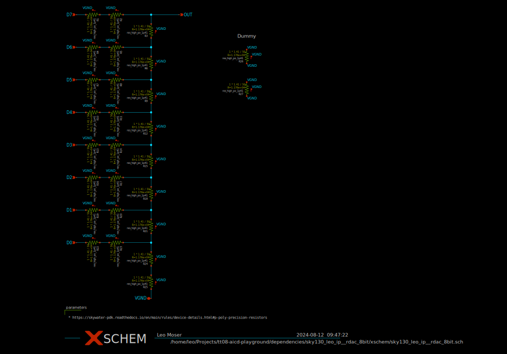

# sky130_leo_ip__rdac_8bit

- Description: A simple 8-bit R2R DAC
- PDK: sky130A

## Authorship

- Designer: Leo Moser
- Created: July 29, 2024
- License: Apache 2.0
- Company: None
- Last modified: None

## Pins

- VGND
  + Description: Ground
  + Type: ground
  + Direction: inout
- D0
  + Description: Digital input 0
  + Type: signal
  + Direction: input
- D1
  + Description: Digital input 1
  + Type: signal
  + Direction: input
- D2
  + Description: Digital input 2
  + Type: signal
  + Direction: input
- D3
  + Description: Digital input 3
  + Type: signal
  + Direction: input
- D4
  + Description: Digital input 4
  + Type: signal
  + Direction: input
- D5
  + Description: Digital input 5
  + Type: signal
  + Direction: input
- D6
  + Description: Digital input 6
  + Type: signal
  + Direction: input
- D7
  + Description: Digital input 7
  + Type: signal
  + Direction: input
- OUT
  + Description: Output of the DAC
  + Type: signal
  + Direction: output

## Default Conditions

## Symbol

## Schematic

## Layout

